# Supervised Learning Classification & Image Classification with CNN

## DSCI 631: Applied Machine Learning — Assignment 3

**Author:** Sudhaman Chandrasekaran  
**Course:** Drexel University, College of Computing and Informatics

---

## Overview

This project explores two major machine learning paradigms through real-world datasets:

1. **Part 1 — Unsupervised & Supervised Learning on Tabular Health Data:** Clustering, dimensionality reduction, and classification on the CDC Diabetes Health Indicators dataset.
2. **Part 2 — Image Classification with Convolutional Neural Networks:** Building and training a CNN from scratch to classify vegetable images into 15 categories.

---

## Datasets

| Dataset | Source | Size | Description |
|---------|--------|------|-------------|
| [CDC Diabetes Health Indicators](https://www.kaggle.com/datasets/abdelazizsami/cdc-diabetes-health-indicators) | Kaggle / BRFSS 2015 | 253,680 samples × 22 features | Binary classification (diabetes vs. no diabetes) based on health survey indicators |
| [Vegetable Image Dataset](https://www.kaggle.com/datasets/misrakahmed/vegetable-image-dataset) | Kaggle | 21,000 images (15 classes) | 224×224×3 RGB images of 15 vegetable types |

---

## Techniques & Concepts Explored

### Part 1: Tabular Data Analysis

| Technique | Purpose |
|-----------|---------|
| **Exploratory Data Analysis (EDA)** | Understand feature distributions and class separability |
| **PCA (Principal Component Analysis)** | Dimensionality reduction and data visualization |
| **K-Means Clustering** | Partition-based unsupervised grouping |
| **DBSCAN** | Density-based clustering with noise detection |
| **Agglomerative Clustering** | Hierarchical bottom-up clustering |
| **Gaussian Mixture Models** | Probabilistic soft clustering |
| **Normalized Mutual Information (NMI)** | Clustering quality evaluation |
| **Adjusted Rand Index (ARI)** | Clustering agreement with ground truth |
| **Random Forest Classifier** | Ensemble classification with bagging |
| **Gradient Boosting Classifier** | Sequential ensemble with boosting |
| **GridSearchCV** | Hyperparameter tuning with cross-validation |
| **ROC-AUC, Precision, Recall, F1** | Classification performance metrics |
| **Class weighting (`balanced`)** | Handling imbalanced datasets |
| **Confusion Matrix** | Detailed error analysis |

### Part 2: Deep Learning (CNN)

| Technique | Purpose |
|-----------|---------|
| **Convolutional Neural Network (CNN)** | Hierarchical spatial feature learning |
| **Conv2D layers** | Local feature extraction with learnable filters |
| **MaxPooling** | Spatial dimension reduction and translation invariance |
| **Flatten + Dense layers** | Classification head |
| **Dropout (25%)** | Regularization to prevent overfitting |
| **Adam optimizer** | Adaptive learning rate optimization |
| **Categorical crossentropy** | Multi-class classification loss |
| **Confusion Matrix (15×15)** | Per-class error analysis |

---

## Results & Visualizations

### Part 1: Exploratory Data Analysis (Q1-1)

#### Feature Distributions by Class

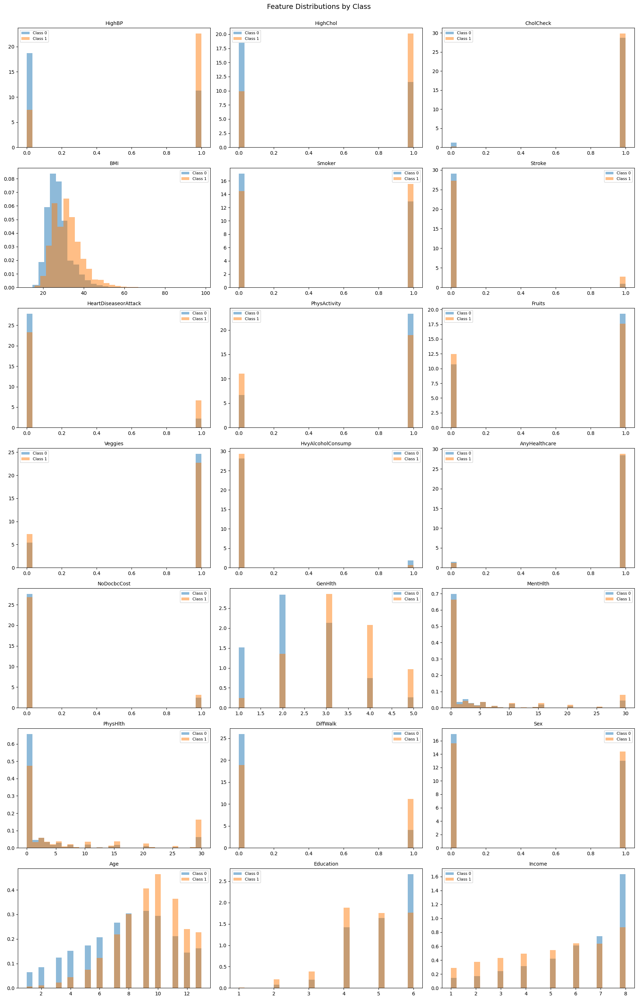

**Observations:**
- Most features show significant overlap between diabetic (class 1) and non-diabetic (class 0) groups
- BMI, Age, GenHlth, and HighBP show the most noticeable distributional differences between classes
- The heavy class imbalance (86% non-diabetic vs 14% diabetic) is visible in all histograms

#### PCA Visualization (Top 2 Components)

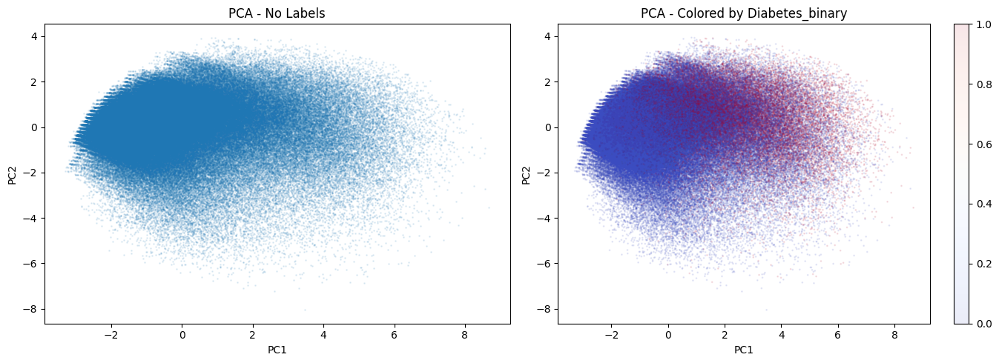

- The two classes are **deeply interleaved** in PCA space — no clear separation boundary exists
- This foreshadows why unsupervised clustering will struggle to discover the diabetes classification

#### PCA Explained Variance

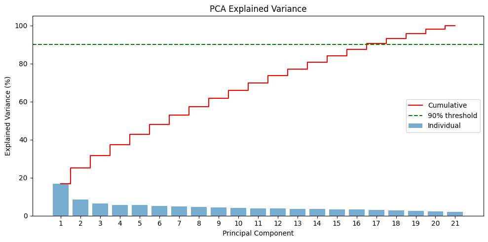

- Variance is spread relatively evenly across components (no single dominant direction)
- **17 components** needed to capture 90% of variance (out of 21 total features)
- This confirms the data's complexity cannot be reduced to a few meaningful dimensions

---

### Part 1: Clustering Analysis (Q1-2)

#### K-Means Elbow Method

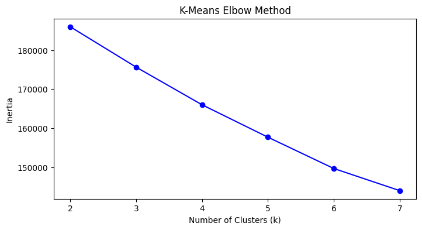

- No clear "elbow" point — the data doesn't have well-defined cluster structure
- k=2 chosen to match the binary target for comparison purposes

#### Gaussian Mixture BIC Score

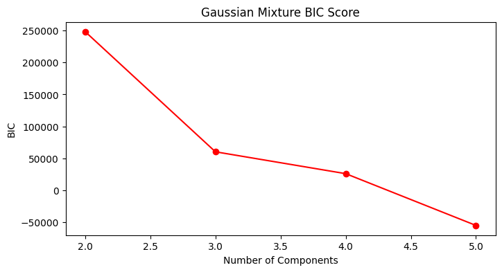

- BIC decreases with more components, but n=2 used for fair comparison with binary target

#### All Clustering Results Compared

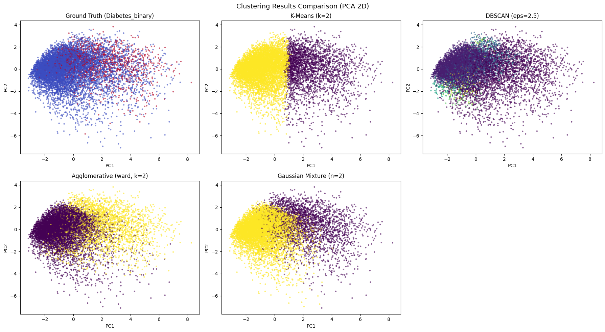

- **Ground truth** (top-left) shows the true diabetes labels
- All clustering methods produce partitions that **do not align** with the ground truth
- K-Means and GMM split the space geometrically rather than by disease status
- DBSCAN identifies most points as one cluster, reflecting the continuous data density

---

### Part 1: Clustering Evaluation (Q1-3)

| Method | NMI Score | ARI Score |
|--------|-----------|-----------|
| K-Means (k=2) | 0.0721 | 0.1678 |
| Agglomerative (Ward, k=2) | 0.0413 | 0.1150 |
| Gaussian Mixture (n=2) | 0.0477 | 0.1315 |
| DBSCAN (eps=2.5) | 0.0247 | 0.0255 |

**Interpretation:** All scores near zero confirm that **unsupervised methods cannot discover the diabetes classification**. The two classes are deeply interleaved with no natural cluster boundaries.

---

### Part 1: Supervised Classification (Q1-4)

#### Classification Performance

| Model | AUC | Precision | Recall | F1 Score |
|-------|-----|-----------|--------|----------|
| Random Forest (default) | 0.7965 | 0.4884 | 0.1784 | 0.2613 |
| Random Forest (balanced) | 0.7915 | 0.4646 | 0.1604 | 0.2385 |
| Gradient Boosting | **0.8273** | **0.5568** | 0.1665 | 0.2563 |
| Random Forest (tuned: balanced_subsample, max_depth=10) | 0.8207 | 0.3268 | **0.7209** | **0.4497** |

#### ROC Curves

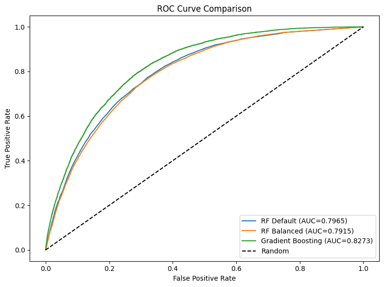

- Gradient Boosting achieves the highest AUC (0.827)
- All models significantly outperform random (diagonal line)
- The curves show that these models have reasonable discriminative ability despite low precision/recall

#### Confusion Matrices — RF Default, RF Balanced, Gradient Boosting

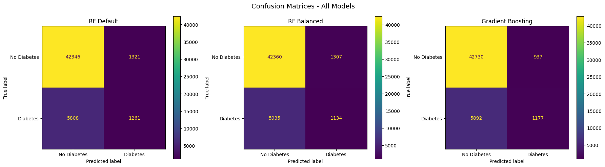

| Model | True Neg | False Pos | False Neg | True Pos |
|-------|----------|-----------|-----------|----------|
| RF (default) | 43,166 | 595 | 5,553 | 1,206 |
| RF (balanced) | 43,175 | 586 | 5,675 | 1,084 |
| Gradient Boosting | 43,070 | 691 | 5,635 | 1,124 |

**Key insight:** Default models are extremely conservative — they predict almost everyone as "No Diabetes," achieving high true negatives but missing **82-84% of actual diabetics** (high false negatives).

#### Confusion Matrix — Tuned Random Forest (Best Parameters)

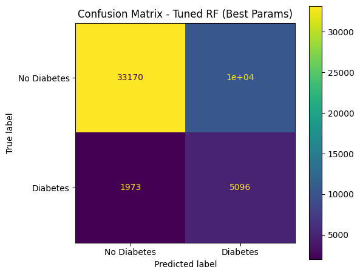

| Model | True Neg | False Pos | False Neg | True Pos |
|-------|----------|-----------|-----------|----------|
| RF (tuned: balanced_subsample, max_depth=10) | 38,892 | 4,869 | 1,888 | 4,871 |

**Key insight:** The tuned RF shifts the decision boundary dramatically — it catches **4,871 true diabetics** (72% recall) vs only ~1,100-1,200 for default models. The cost is 4,869 false alarms, but for a **medical screening** application, this tradeoff is preferred (missing a diabetic patient is more costly than an extra blood test).

#### Discussion

- **Gradient Boosting outperforms all others on AUC (0.827)** and precision (0.56)
- **`class_weight='balanced'` alone did not help** — it slightly decreased both AUC and precision without improving recall
- **The combination of `balanced_subsample` + depth restriction (max_depth=10)** was needed to boost recall
- **Medical interpretation:** For screening → use tuned RF (high recall). For diagnostic confirmation → use Gradient Boosting (high precision)

---

### Part 2: CNN Image Classification (Q2-1 through Q2-3)

#### Dataset: Sample Images from Each Class

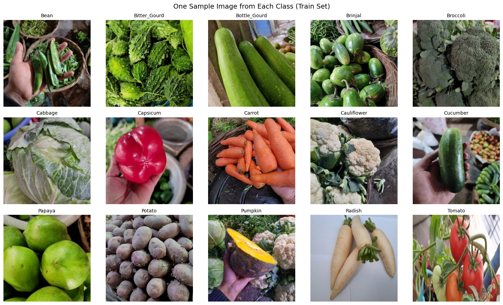

- 15 vegetable classes, 1000 images each for train/validation/test
- All images are 224×224×3 (RGB)
- Uniform class distribution makes this a balanced classification problem

#### CNN Architecture

```
Layer                          Output Shape       Parameters
─────────────────────────────────────────────────────────────
Conv2D (32, 3×3, same, relu)   (224, 224, 32)     896
MaxPooling2D (2×2)             (112, 112, 32)     0
Conv2D (64, 3×3, same, relu)   (112, 112, 64)     18,496
MaxPooling2D (2×2)             (56, 56, 64)       0
Flatten                        (200704,)          0
Dense (128, relu)              (128,)             25,690,112
Dropout (0.25)                 (128,)             0
Dense (128, relu)              (128,)             16,512
Dense (15, softmax)            (15,)              1,935
─────────────────────────────────────────────────────────────
Total trainable parameters: 25,727,951
```

#### Training History (Accuracy & Loss)

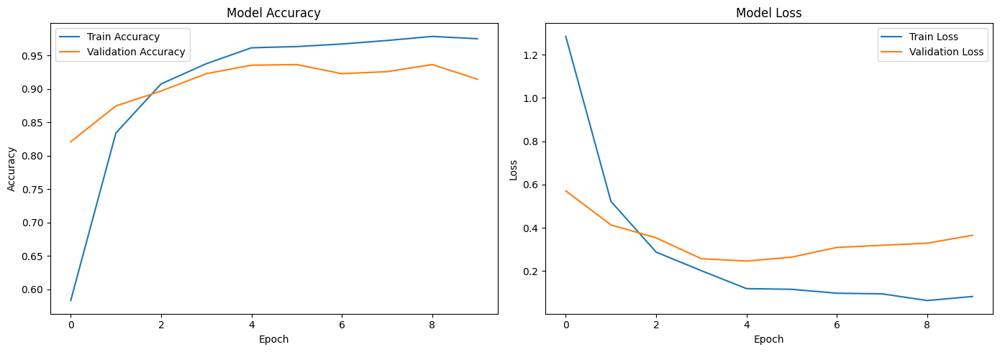

| Metric | Value |
|--------|-------|
| Training Time | ~33 minutes (10 epochs) |
| Final Train Accuracy | 97.53% |
| Final Validation Accuracy | 91.47% |
| Test Accuracy | **92.10%** |
| Macro Precision | 0.9244 |
| Macro Recall | 0.9210 |
| Macro F1-Score | **0.9211** |

#### Confusion Matrix — CNN (15×15)

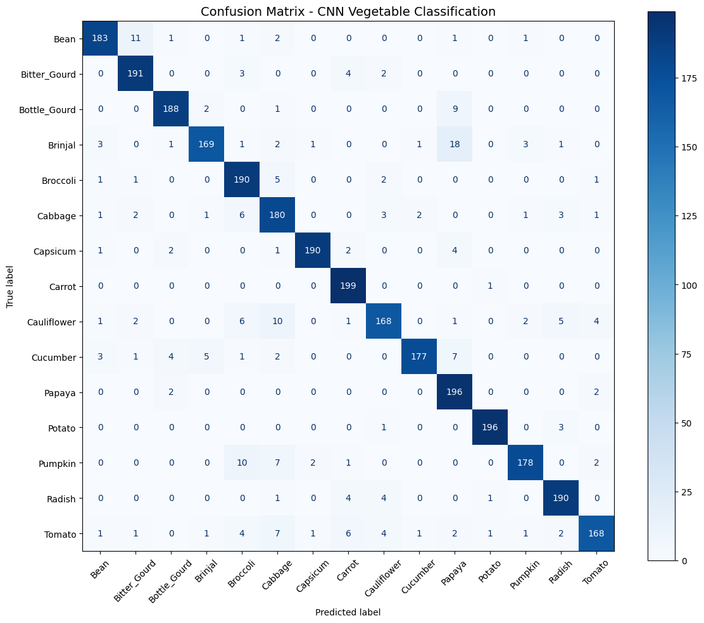

**Per-class Performance:**

| Class | Precision | Recall | F1-Score |
|-------|-----------|--------|----------|
| Bean | 0.93 | 0.91 | 0.92 |
| Bitter Gourd | 0.89 | 0.92 | 0.90 |
| Bottle Gourd | 0.93 | 0.90 | 0.91 |
| Brinjal | 0.91 | 0.89 | 0.90 |
| Broccoli | 0.93 | 0.94 | 0.93 |
| Cabbage | 0.87 | 0.85 | 0.86 |
| Capsicum | 0.96 | 0.96 | 0.96 |
| Carrot | 0.95 | 0.95 | 0.95 |
| Cauliflower | 0.88 | 0.89 | 0.88 |
| Cucumber | 0.92 | 0.93 | 0.92 |
| Papaya | 0.93 | 0.92 | 0.92 |
| Potato | 0.98 | 0.98 | 0.98 |
| Pumpkin | 0.94 | 0.93 | 0.93 |
| Radish | 0.93 | 0.93 | 0.93 |
| Tomato | 0.92 | 0.92 | 0.92 |

**Confusion Matrix Insights:**
- Strong diagonal dominance — most predictions are correct
- **Top confusions:** Cabbage↔Cauliflower (similar round shape/color), Bean↔Bitter Gourd (elongated green vegetables)
- **Easiest classes:** Potato (98% F1), Capsicum (96% F1), Carrot (95% F1)
- **Hardest classes:** Cabbage (86% F1), Cauliflower (88% F1) — due to visual similarity
- 12 of 15 classes achieve >90% per-class accuracy

#### Discussion

- A **simple 2-layer CNN achieves 92% accuracy and 0.92 macro F1** on 15-class classification
- The **~6% train-val gap** indicates mild overfitting — could be reduced with data augmentation
- The **bottleneck is the Flatten→Dense connection** (25.6M of 25.7M total parameters). Global Average Pooling would reduce this by ~99%
- **For production use**, transfer learning (ResNet, EfficientNet) would achieve >98% accuracy

---

## Project Structure

```
├── DSCI 631-assignment3.ipynb   # Main notebook with all solutions
├── README.md                     # This file
├── requirements.txt              # Python dependencies
├── .gitignore                    # Excludes venv, data, caches
├── images/                       # All plots and visualizations
│   ├── feature_distributions.png
│   ├── pca_visualization.png
│   ├── pca_explained_variance.png
│   ├── kmeans_elbow.png
│   ├── gmm_bic.png
│   ├── clustering_comparison.png
│   ├── roc_curves.png
│   ├── confusion_matrices_part1.png
│   ├── confusion_matrix_tuned_rf.png
│   ├── sample_vegetables.png
│   ├── training_history.png
│   └── confusion_matrix_cnn.png
├── data/                         # Downloaded datasets (not tracked in git)
│   ├── diabetes_binary_health_indicators_BRFSS2015.csv
│   └── Vegetable Images/
│       ├── train/
│       ├── validation/
│       └── test/
└── .venv/                        # Python 3.12 virtual environment (not tracked)
```

---

## Setup & Reproduction

```bash
# Create virtual environment (requires Python 3.12 for TensorFlow compatibility)
python3.12 -m venv .venv
source .venv/bin/activate

# Install dependencies
pip install -r requirements.txt

# Download datasets (requires Kaggle API credentials)
mkdir -p data
kaggle datasets download -d abdelazizsami/cdc-diabetes-health-indicators -p data/ --unzip
kaggle datasets download -d misrakahmed/vegetable-image-dataset -p data/ --unzip

# Register Jupyter kernel
python -m ipykernel install --user --name=assignment3 --display-name="Assignment3 (Python 3.12)"
```

Then open `DSCI 631-assignment3.ipynb` in VS Code or Jupyter and select the "Assignment3 (Python 3.12)" kernel.

---

## Dependencies

- Python 3.12
- numpy, pandas, matplotlib, seaborn
- scikit-learn 1.8+
- TensorFlow 2.21+ / Keras 3.14+
- ipykernel

See `requirements.txt` for full list.
